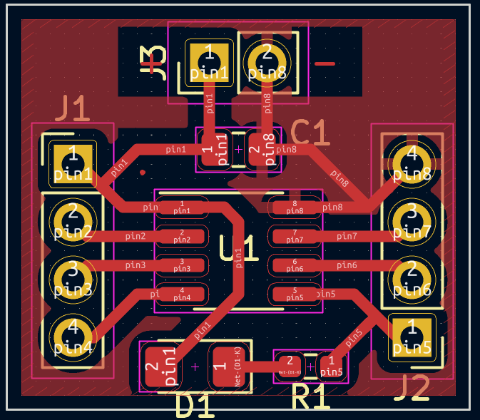

# Circuito realizado para el taller de soldadura avanzada

En este repositorio está el código (se compila con el compilador gratuito de Microchip XC8) y PCB (se abre con KiCad >7) del circuito _blinky_ realizado para el taller de soldadura avanzada brindado por @gzalo.

- C1: capacitor cerámico de 100nF
- D1: diodo LED
- R1: resistencia de 220 o 330 ohms (código 221/331) 
- U1: microcontrolador PIC12f683 con el hex ya programado
